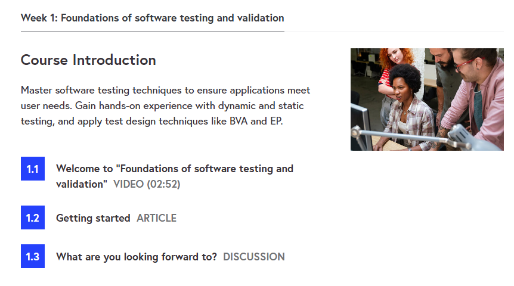
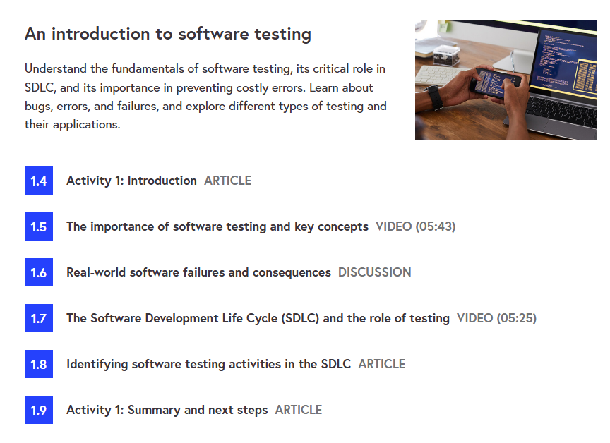
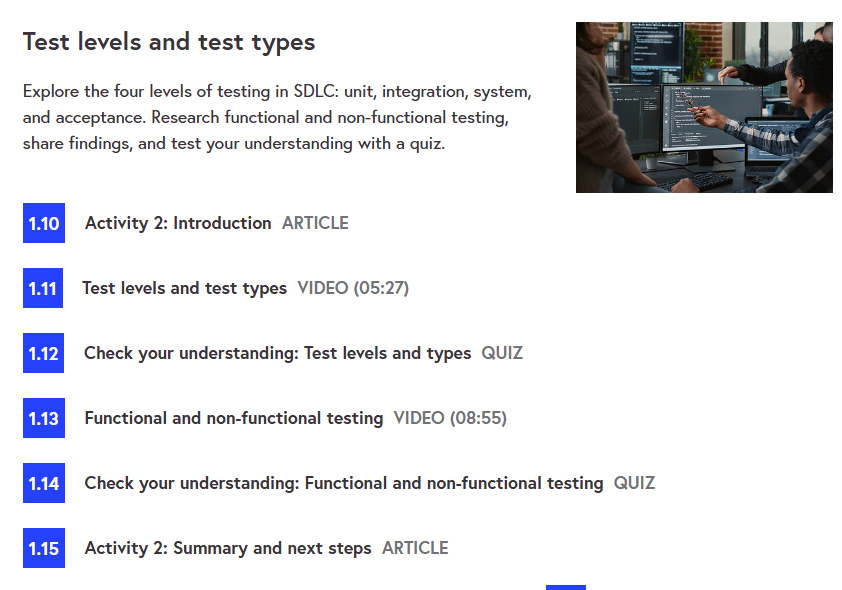
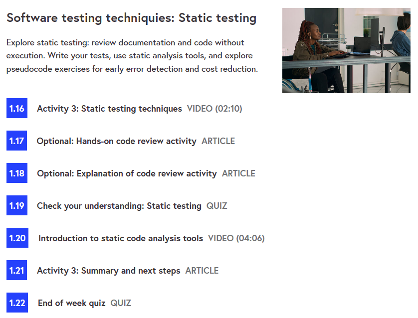
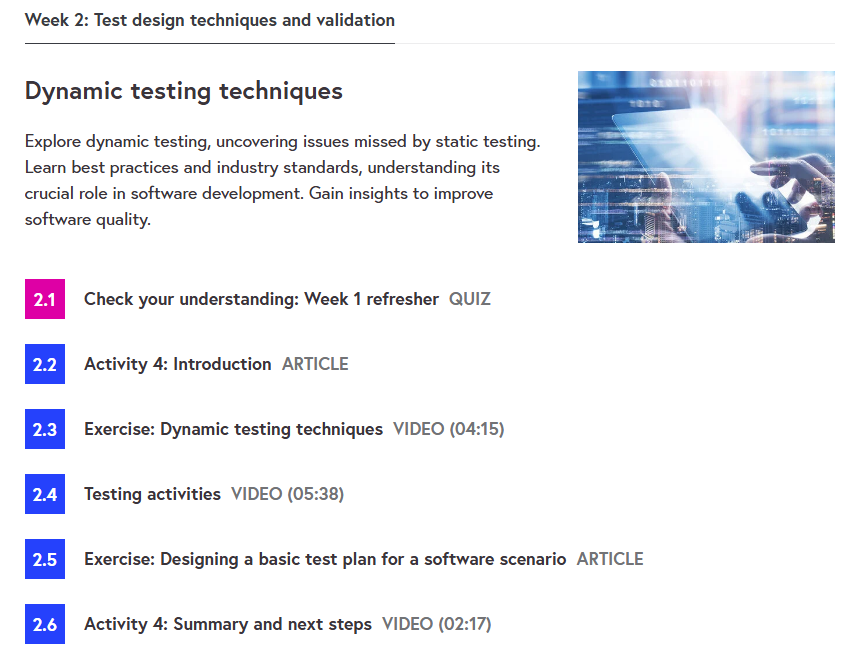
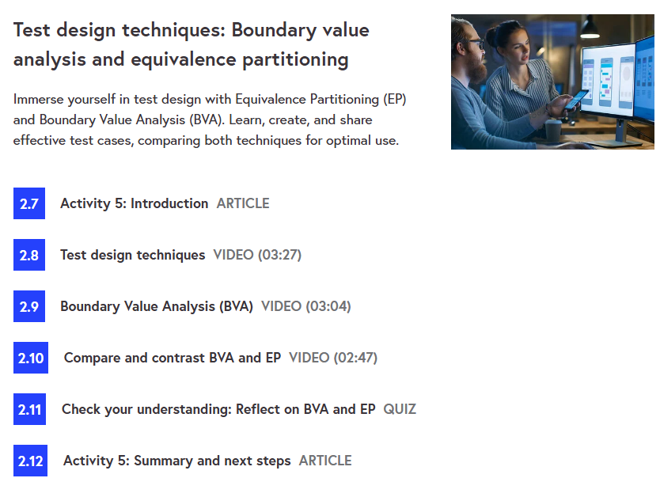
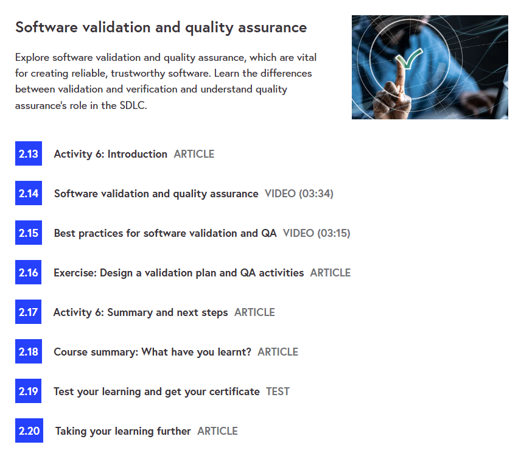

# 🧪 Foundations of Software Testing and Validation – University of Leeds

This repository contains **notes, labs, cheatsheets, scenarios, case studies, and a certificate of completion** for the  
*Foundations of Software Testing and Validation* course by **University of Leeds** on *FutureLearn*.  
The program provides a foundation in **testing principles, test design, automation, validation, and defect management**.

---

## 📚 Notes
- 📄 [01-introduction.md](./notes/01-introduction.md) – Course introduction  
- 📄 [02-testing-fundamentals.md](./notes/02-testing-fundamentals.md) – Core testing principles  
- 📄 [03-test-design-techniques.md](./notes/03-test-design-techniques.md) – Test design methods  
- 📄 [04-test-management.md](./notes/04-test-management.md) – Test process & management  
- 📄 [05-automation-and-best-practices.md](./notes/05-automation-and-best-practices.md) – Test automation  

---

## 🧪 Labs
- 🔧 [automation-demo.md](./labs/automation-demo.md) – Basic automation demonstration  
- 🔧 [boundary-value-lab.md](./labs/boundary-value-lab.md) – Boundary value analysis  
- 🔧 [test-plan-lab.md](./labs/test-plan-lab.md) – Writing a test plan  
- 🔧 [unit-testing-lab.md](./labs/unit-testing-lab.md) – Unit testing practice  

---

## 📋 Cheatsheets
- 📘 [coverage-criteria.md](./cheatsheets/coverage-criteria.md) – Coverage criteria quick ref  
- 📘 [defect-lifecycle.md](./cheatsheets/defect-lifecycle.md) – Defect lifecycle guide  
- 📘 [test-design-techniques.md](./cheatsheets/test-design-techniques.md) – Test design strategies  
- 📘 [test-levels.md](./cheatsheets/test-levels.md) – Unit, integration, system, acceptance  

---

## 🎯 Scenarios
- 📝 [bug-report-examples.md](./scenarios/bug-report-examples.md) – Example bug reports  
- 📝 [regression-testing-scenario.md](./scenarios/regression-testing-scenario.md) – Regression testing use case  
- 📝 [test-case-examples.md](./scenarios/test-case-examples.md) – Sample test cases  

---

## 🔬 Extras
- 📑 [case-studies.md](./extras/case-studies.md) – Real-world case studies  
- 📑 [resources.md](./extras/resources.md) – References & learning resources  
- 📆 [timeline.md](./extras/timeline.md) – Timeline of testing practices  

---

## 📖 Docs
- 📘 [index.md](./docs/index.md) – Program overview  
- 📘 [glossary.md](./docs/glossary.md) – Glossary of testing terms  
- 📘 [references.md](./docs/references.md) – External references  
- 📘 [roadmap.md](./docs/roadmap.md) – Learning roadmap  
- 📘 [syllabus.md](./docs/syllabus.md) – Course syllabus  

---

## 📸 Screenshots

| Step | Screenshot |
|------|------------|
| 📚 Week 1 – Intro |  |
| 🔍 Week 1 – Basics |  |
| 🧩 Week 1 – Labs |  |
| 📝 Week 1 – Review |  |
| 🏫 Week 2 – Course |  |
| 🧪 Week 2 – Exercises |  |
| ⭐ Week 2 – Wrap-up |  |

---

## 📜 Certificate
🎓 [Certificate of Achievement – Foundations of Software Testing and Validation](./cert/foundations-of-software-testing-and-validation_certificate_of_achievement_7bdx7nw.pdf)  

---

## 📝 Personal Review
This course gave me **a strong foundation in software testing and validation practices**,  
from **fundamentals of test design** to **automation and defect management**.  
The mix of **hands-on labs, real-world scenarios, and structured notes** helped me build both **theoretical knowledge** and **practical skills**.

---

## ✍️ Author
**Thành Danh** – Red Team Learner & Security Researcher  

- GitHub: [@ngvuthdanhh](https://github.com/ngvuthdanhh)  
- Email: ngvu.thdanh@gmail.com  

---

## 📄 License
This project is licensed under the terms of the **MIT License**. See [LICENSE](./LICENSE) for full details.  
© 2025 ngvuthdanhh. All rights reserved.  
